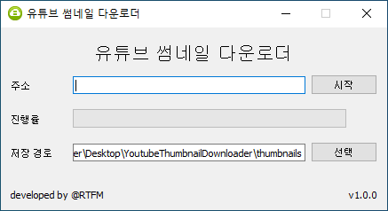

# Youtube Thumbnail Downloader

## 사용법

### GUI 버전 사용법

1. 주소 입력란에 단일 영상 주소나 재생목록 주소 및 채널 주소를 입력하세요.
2. 저장 경로를 선택하세요. 기본값은 현재 폴더 하위의 thumbnails 폴더입니다.
3. 시작 버튼을 누르면 불러올 수 있는 최선의 해상도로 썸네일이 일괄 추출됩니다.
4. 썸네일 추출 중 추출을 중단하고 싶다면 중지 버튼을 눌러주세요.

### CLI 버전 사용법
```
youtube_thumbnail_downloader_cli --url="주소"

youtube_thumbnail_downloader_cli --url="주소" --save_dir="저장 경로"
```

## 주의사항
본 프로그램은 마이크로소프트 엣지 브라우저 기반으로 작동합니다.  
만약 엣지 브라우저가 설치되어 있지 않다면 설치 후 사용바랍니다.  

프로그램이 시작되면 설치된 엣지 브라우저의 버전과 호환되는 웹 드라이버를 자동으로 다운로드 받아 로드하며,  
다운로드된 웹 드라이버는 사용자 홈 폴더 하위의 .wdm 폴더에 저장됩니다.  

## 개발환경
- Windows
- Anaconda 4.10.1
- Python 3.8.8
- Python Library
	- PyQt5
	- selenium
	- requests
	- webdriver-manager

자세한 실행 파일 패키징 과정은 [**packaging_command.md**](packaging_command.md) 참조
